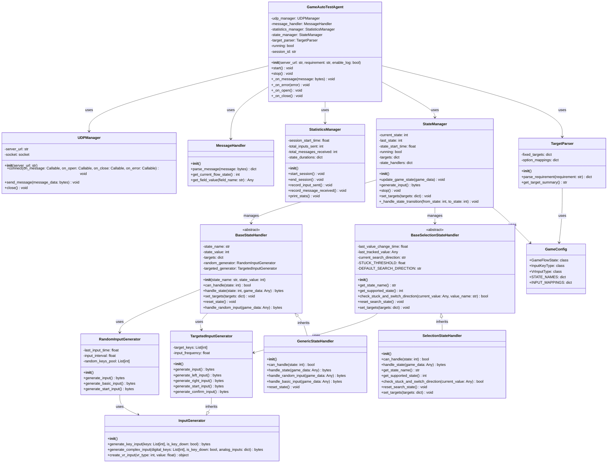
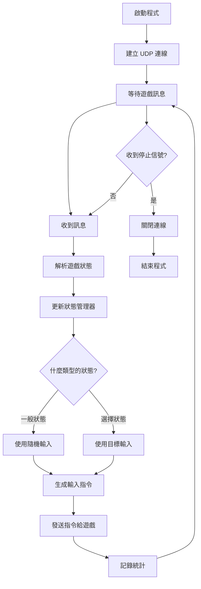
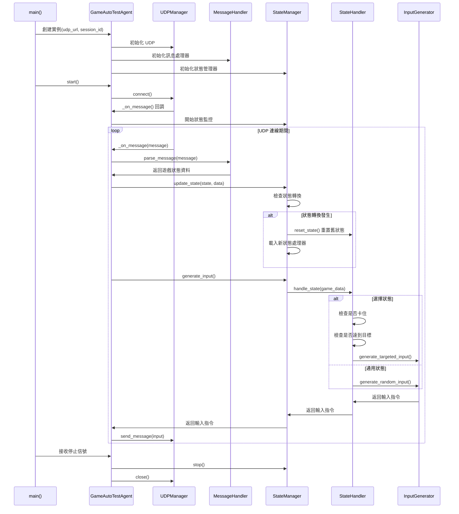
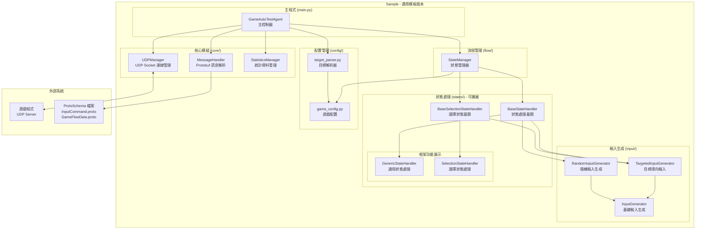

# AutoTestAgent UML 說明文件 - Sample 通用模板版本

## 類別圖 (Class Diagram)

## 流程圖 (Flowchart) - 框架執行流程

## 序列圖 (Sequence Diagram) - 通用執行流程

## 組件圖 (Component Diagram) - 通用架構

## 📝 Sample 通用模板架構特色說明

### 🎯 **通用模板設計**
- **可擴展狀態處理器**: 基礎狀態處理器可根據需要擴展
- **通用配置**: 支援任何遊戲的配置和選項
- **完整測試**: 支援目標導向和隨機測試模式

### 🔧 **模組化設計**
- **BaseStateHandler**: 通用狀態處理基類
- **BaseSelectionStateHandler**: 選擇狀態專用基類
- **繼承架構**: 清晰的繼承關係和職責分離

### 🚀 **輸入生成系統**
- **InputGenerator**: 基礎輸入生成功能
- **TargetedInputGenerator**: 繼承 InputGenerator，提供目標導向輸入
- **RandomInputGenerator**: 使用 InputGenerator，提供隨機輸入

### 🎮 **通用遊戲支援**
- **可配置狀態覆蓋**: 根據 Proto 定義生成所有狀態
- **智能選擇邏輯**: 通用的選擇導航和卡住檢測
- **靈活配置**: 支援任何遊戲的選項和名稱映射

### 🧪 **模板級品質**
- **錯誤處理**: 完整的異常處理機制
- **統計功能**: 詳細的執行統計和報告
- **日誌系統**: 完整的執行日誌記錄
- **目標解析**: 靈活的測試目標設定

這個 UML 設計展現了 Sample 作為一個通用的、可擴展的遊戲自動測試模板，具備完整的架構設計和靈活的配置能力。

---

## 📝 Sample 通用模板特色

### 🔧 **模板化設計**
- **基礎狀態處理器**: 提供通用的狀態處理邏輯
- **選擇狀態基類**: 專門處理選擇流程的智能邏輯
- **配置驅動**: 所有遊戲特定內容通過配置定義

### 🎯 **核心架構優勢**
- **繼承設計**: TargetedInputGenerator 繼承 InputGenerator
- **模組化**: 每個狀態獨立處理器
- **可擴展**: 易於添加新狀態或修改邏輯
- **通用性**: 適用於任何遊戲類型

### 📊 **與具體實作的關係**
| 項目 | Sample (通用模板) | 具體遊戲版本 |
|------|------------------|-------------|
| **狀態處理器** | 基礎類別和範例 | 完整具體處理器 |
| **配置完整性** | TODO 標記 | 完整遊戲配置 |
| **輸入生成** | 繼承模式 | 繼承模式 |
| **測試就緒** | 需要轉換 | 立即可用 |

Sample 代表了 AutoTestAgent 架構的通用模板，是所有具體遊戲版本的基礎參考。
